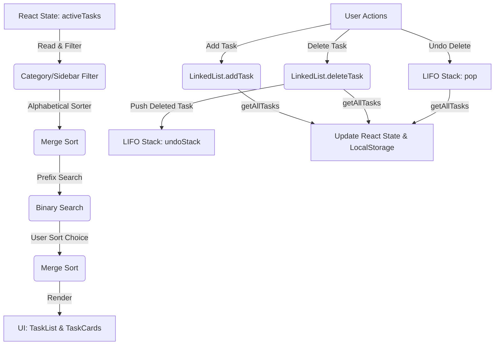

# Smart Todo Manager — DSA Viva Study Guide

This document is a comprehensive study guide designed to prepare you for your academic demonstration/viva. It explains the custom Data Structures and Algorithms implemented in this application, their complexity analyses, integration with React, and common viva questions.

---

## 1. Project Architecture Overview

The **Smart Todo Manager** is structured to showcase clean separation between the **UI layer (React)** and the **DSA layer (Custom Data Structures & Algorithms)**. 

### Data Flow Diagram



---

## 2. Linked List Data Structure
**File:** [LinkedList.js](file:///d:/Project/SmartTodo/src/dataStructures/LinkedList.js)

### Why Use a Linked List?
A Linked List is a dynamic data structure consisting of nodes where each node contains data (a task object) and a reference (`next`) to the next node in the sequence. In contrast to arrays:
* **Dynamic Sizing**: Elements can be added indefinitely without memory reallocation or sizing limits.
* **Insertion/Deletion Efficiency**: Removing elements or inserting them doesn't require shifting subsequent elements in memory.

### Implementation Details
* **Node Class**: Represents the fundamental building block.
  ```javascript
  class Node {
    constructor(task) {
      this.task = task; // Contains id, title, priority, dueDate, completed, createdAt
      this.next = null; // Pointer to the next Node
    }
  }
  ```
* **`addTask(task)`**: Traverses from the `head` to the last node ($O(n)$ time) and points its `next` to the new node. (If keeping a `tail` pointer, this could be optimized to $O(1)$).
* **`deleteTask(id)`**: Searches the list node-by-node. When it finds the node with the target ID, it updates the predecessor node's `next` pointer to bypass the deleted node, deleting it in-place.
* **`getAllTasks()`**: Traverses from the head to the end, assembling all tasks into a standard Javascript array so React's reactive rendering engine can detect state updates.

### Complexity Analysis
| Operation | Time Complexity | Space Complexity | Explanation |
| :--- | :--- | :--- | :--- |
| **Add (Append)** | $O(n)$ | $O(1)$ | Must traverse the list to find the end. |
| **Delete (by ID)** | $O(n)$ | $O(1)$ | Worst-case requires scanning the entire list. |
| **Search (Linear)** | $O(n)$ | $O(1)$ | Must scan elements sequentially. |

---

## 3. Stack Data Structure (LIFO)
**File:** [Stack.js](file:///d:/Project/SmartTodo/src/dataStructures/Stack.js)

### Why Use a Stack for "Undo"?
A Stack is a **Last-In, First-Out (LIFO)** data structure. The most recently deleted task is the first one that should be restored when clicking "Undo". This makes the LIFO property of a stack perfect for tracking operations that need to be reversed in sequence.

### Key Operations
* **`push(item)`**: Pushes a deleted task object onto the top of the stack.
* **`pop()`**: Removes and returns the top task from the stack.
* **`peek()`**: Looks at the top task without removing it (used in the UI to display the item name or stack count).

### Complexity Analysis
| Operation | Time Complexity | Space Complexity |
| :--- | :--- | :--- |
| **Push** | $O(1)$ | $O(1)$ |
| **Pop** | $O(1)$ | $O(1)$ |
| **Peek** | $O(1)$ | $O(1)$ |

---

## 4. Merge Sort Algorithm
**File:** [mergeSort.js](file:///d:/Project/SmartTodo/src/algorithms/mergeSort.js)

### Why Use Merge Sort?
Merge Sort is a **Divide-and-Conquer** sorting algorithm. It is chosen for the following reasons:
1. **Stable Sorting**: Preserves the relative order of items with equal keys (important when sorting tasks that have the same due date or priority).
2. **Guaranteed Complexity**: Unlike Quick Sort, which can degrade to $O(n^2)$ on poorly partitioned inputs, Merge Sort guarantees $O(n \log n)$ time complexity in all cases.

### How it Works
1. **Divide**: Split the array into two halves.
2. **Conquer**: Recursively sort both halves.
3. **Combine**: Merge the two sorted halves into a single sorted array using a comparison helper.

### Custom Comparators
Since our tasks can be sorted by three different fields, we implemented a custom comparison function:
* **Priority**: High (weight 3), Medium (weight 2), and Low (weight 1). By default, high weight is sorted first.
* **Due Date**: Converts date strings into Unix timestamps and compares chronologically. Tasks with no due dates are placed at the bottom.
* **Alphabetical**: Case-insensitive title comparisons.

### Complexity Analysis
* **Time Complexity**: $O(n \log n)$ in Best, Average, and Worst cases.
* **Space Complexity**: $O(n)$ auxiliary space is required for merging temporary subarrays.

---

## 5. Binary Search Algorithm
**File:** [binarySearch.js](file:///d:/Project/SmartTodo/src/algorithms/binarySearch.js)

### Why Use Binary Search?
Binary Search is an $O(\log n)$ lookup algorithm. It is drastically faster than linear scanning ($O(n)$) for large datasets.

### The Sorted Requirement
Binary search works by dividing the search range in half. For this division to be mathematically valid, the array **must be pre-sorted**. In our code, we use our custom `mergeSort` to sort the tasks alphabetically by title *before* passing them to `binarySearch`.

### Substring / Prefix Match Expansion
Standard binary search returns a single index for an exact match. However, when users type into a search bar, they expect prefix-matching (e.g. typing "Re" matches both "React Setup" and "Review Code").
Our algorithm handles this:
1. Find one matching element index `mid` using binary search.
2. If `mid` starts with the query, scan **left** and **right** of `mid` to collect all adjacent elements that also share the prefix.
3. Assemble and return this contiguous range of matches.

### Complexity Analysis
* **Time Complexity**: $O(\log n)$ to find the initial index, plus $O(k)$ where $k$ is the number of matching duplicate prefixes.
* **Space Complexity**: $O(1)$ auxiliary space (excluding results array).

---

## 6. How React and Custom DSA Integrate

Since React components rely on **immutability** to detect state changes and trigger UI re-renders, mutable structures like Linked Lists must be carefully bridged:
1. **State Storage**: React stores active tasks in state as a standard array: `const [tasks, setTasks] = useState([]);`.
2. **Linked List Bridge**: When tasks are added or deleted:
   * We initialize a new `LinkedList` from the current array: `const list = LinkedList.fromArray(tasks);`
   * Run the custom Linked List method: `list.addTask(newTask);`
   * Export the new structure to an array to update React state: `setTasks(list.getAllTasks());`
3. **Undo Stack Preservation**: The LIFO stack is stored inside a React `useRef`: `const undoStackRef = useRef(new Stack());`. This ensures the stack memory survives React's frequent component re-renders.

---

## 7. Common Viva Questions & Answers

### Q1: Why did you convert the Linked List back into an array in React?
**Answer:** React is built around functional programming paradigms and detects changes via state reference changes. If we directly mutated a `LinkedList` class object, React would not register the update because the reference to the list object remains unchanged. Converting to a new array forces React to see a new memory reference, instantly triggering a clean DOM re-render.

### Q2: What is the benefit of Merge Sort over Quick Sort in this specific app?
**Answer:** Merge Sort is **stable**, whereas standard Quick Sort is not. Stability means that if two tasks have the same priority (e.g. both are High), their relative order (such as insertion sequence) will not change after sorting. Also, Merge Sort has a guaranteed worst-case time complexity of $O(n \log n)$, whereas Quick Sort can degrade to $O(n^2)$ if the array is already sorted.

### Q3: Why does Binary Search require the data to be sorted?
**Answer:** Binary Search relies on the property of ordering to discard half of the search space in each iteration. Without sorting, we cannot determine whether the target item lies to the left or right of the middle element, rendering the binary division impossible.

### Q4: How is the Undo Delete stack LIFO?
**Answer:** When a user deletes a task, we perform a LIFO `push` operation to add it to the top of our custom stack. When the user clicks "Undo", we `pop` the element, which retrieves the most recently deleted item (the top of the stack). This demonstrates the LIFO (Last-In, First-Out) principle.

### Q5: What is the time complexity of searching a task by title in your app?
**Answer:**
1. First, we sort the array alphabetically using Merge Sort which takes $O(n \log n)$ time.
2. Then, we perform Binary Search which takes $O(\log n)$ time.
So, the total search operation takes $O(n \log n)$ time due to the pre-sorting step. If we did a linear search, it would be $O(n)$ but without showing the Binary Search algorithm.

---

## 8. Summary of Complexity Ratings

| Component / File | Algorithm / DS | Best Case | Average Case | Worst Case | Space Complexity |
| :--- | :--- | :--- | :--- | :--- | :--- |
| **LinkedList** | Singly Linked List | $O(1)$ | $O(n)$ | $O(n)$ | $O(n)$ |
| **Stack** | LIFO Array Stack | $O(1)$ | $O(1)$ | $O(1)$ | $O(n)$ |
| **mergeSort.js** | Divide-and-Conquer | $O(n \log n)$ | $O(n \log n)$ | $O(n \log n)$ | $O(n)$ |
| **binarySearch.js** | Binary Search | $O(1)$ | $O(\log n)$ | $O(\log n)$ | $O(1)$ |
